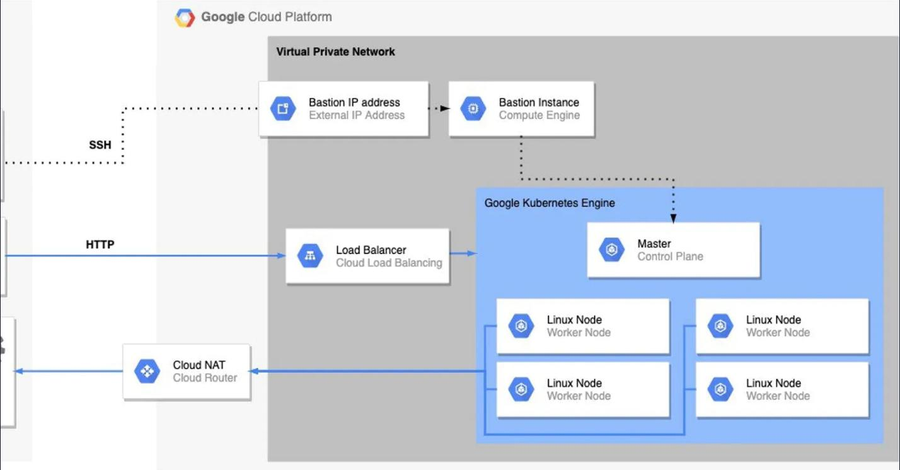
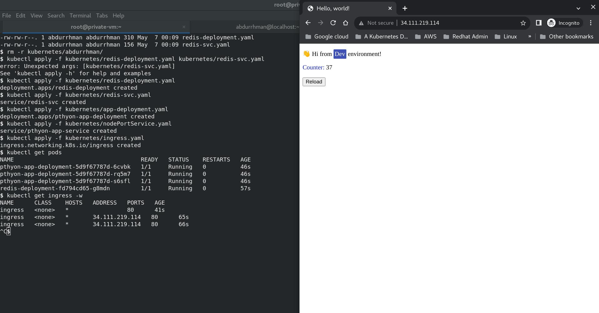

# Provisioning Infrastucture on GCP using Terraform
## Project Info
This code is used to provision an infrasturcture on GCP.

The infrasturcture includes:\
a. One VPC \
b. Two subnets (management subnet & restricted subnet)
1. Management subnet has the following:\
• NAT gateway \
• Private VM
2. Restricted subnet has the following:\
• Private standard GKE cluster


### Tools Used

<p align="center">
<a href="https://www.terraform.io/" target="_blank" rel="noreferrer">  </a> <a href="https://cloud.google.com" target="_blank" rel="noreferrer">  </a> <a href="https://kubernetes.io" target="_blank" rel="noreferrer">  </a> <a href="https://www.python.org" target="_blank" rel="noreferrer">  </a>
</p>

### Provisioning the infrastucture using terraform
First clone this repo
```bash
git clone https://github.com/AbdurrhmanSabry/terraform-gcp-task-.git
```

Then, To be able to use terraform with GCP you need to:
1. Create the service account. Replace NAME with a name for the service account:
```bash
gcloud iam service-accounts create NAME
```
2. Grant roles to the service account. Run the following command once for each of the following IAM roles: roles/owner:
```bash
gcloud projects add-iam-policy-binding PROJECT_ID --member="serviceAccount:NAME@PROJECT_ID.iam.gserviceaccount.com" --role=roles/owner
```
3. Generate the key file:
```bash
gcloud iam service-accounts keys create FILE_NAME.json --iam-account=NAME@PROJECT_ID.iam.gserviceaccount.com
```
4. Passing credentials via environment variable
```bash
export GOOGLE_APPLICATION_CREDENTIALS="KEY_PATH"
```
5. Create a bucket in gcs and add its name to the backend file and enable versioning.
6. Now initialize terraform by running
```bash
terraform init
```
7. Create a workspace 
```bash
terraform workspace new name
```
8. Add values to the variables defined variables.tf in file named name.tfvars. Replace name here with the name of the workspace you created.

9. Create the Resources
```bash
terraform apply -var-file namefile.tfvars
```
### Containerizing the application
To build an image of the application do the following: 
1. Go to  the directory with Dockerfile
2. Build the image
```bash
docker build -t python-app:alpine .
```
3. Tag the image with a registry name
```bash
docker tag gcr.io/google-samples/hello-app:1.0 gcr.io/PROJECT_ID/quickstart-image:tag1
```
4.  Configure Docker
```bash
gcloud auth configure-docker
```
5. Push the image to Container Registry
```bash
docker push gcr.io/PROJECT_ID/quickstart-image:tag1
```
### Accessing the private VM
1. Generate key to the service account of the 
```bash
gcloud iam service-accounts keys create FILE_NAME.json --iam-account=NAME@PROJECT_ID.iam.gserviceaccount.com
```
2. Copy the file to the VM 
```bash
gcloud compute scp LOCAL_FILE_PATH VM_NAME:~
```
3. Access the vm using the ssh through the IAP tunnels
```bash 
gcloud compute ssh --zone Zone VM_NAME  --tunnel-through-iap --project Project
```
4. Activate the service account 
```bash
gcloud auth activate-service-account [ACCOUNT] --key-file=KEY_FILE
```

### Accessing the kubernetes cluster and Deploying the components

1. Copy the kubernetes definition files to the VM
```bash
gcloud compute scp --recurse  kubernetes/ VM_NAME:kubernetes
```
2. Inside the VM, install the kubectl util after switching to the root user
```bash
sudo -i
yum install kubectl -y
```
3. Get the credientials to access the cluster
```bash
gcloud container clusters get-credentials CLUSTER_NAME --region REGION --project PROJECT
```

4. Deploy the components
```bash
kubectl apply -f kubernetes/redis-deployment.yaml
kubectl apply -f kubernetes/redis-svc.yaml
kubectl apply -f kubernetes/app-deployment.yaml
kubectl apply -f kubernetes/nodePortService.yaml
kubectl apply -f kubernetes/ingress.yaml
```
The result should look like this
